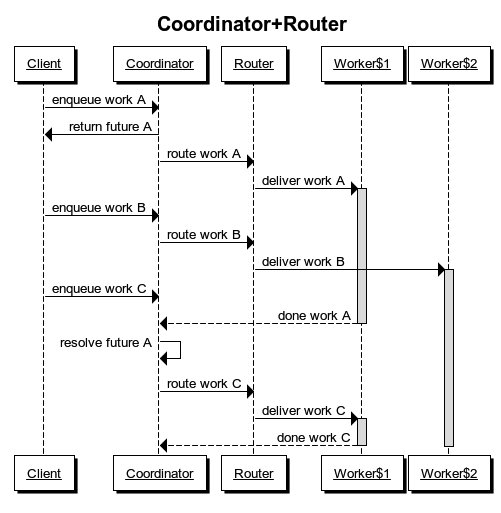

!SLIDE[bg=images/beanstalksurf.jpg]
### Jacob Burkhart
    
    
     
# [@beanstalksurf](http://twitter.com/beanstalksurf)

.notes take out the sleeps?
.notes use the full work queue
.notes Tim says look at app-engine pipeline
.notes "eye" like bluebill or monit
.notes FIND the celluloid loop (Tim can help)
.notes Celluloid Logger

.notes progression of sequential -> threaded -> multi-machine... easy -> hard
.notes tim's list of interesting things https://gist.github.com/halorgium/3724a6c202f81f33c8c6

!SLIDE[bg=images/ey-bg.png] reallybig
#Ruby 2.0 GA
#on
#Engine Yard Cloud

!SLIDE[bg=images/goldengate.jpg]
### How to Fail at Background Jobs
            
## `jacobo.github.com/background_jobs_kaigi`

!SLIDE[bg=images/banjo.jpg]
### What do I know?

!SLIDE biggercode
### The simplest thing that can possibly work

••••••••

 

    @@@ ruby
    (0..50).each do |x|
      50.times{print [128000+x].pack "U*"}
    end

!SLIDE biggercode
###Threads

••••••••

    @@@ ruby
    work = (0..50).to_a
    worker = lambda do |x|
      50.times{print [128000+x].pack "U*"}
    end

    workers = work.map do |x|
      Thread.new do
        worker.call(x)
      end
    end; "ok"
    workers.map(&:join); "ok"

!SLIDE biggishcode
###Thread Pool

••••••••

    @@@ ruby
    require 'thread'
    work_q = Queue.new
    (0..50).to_a.each{|x| work_q.push x }
    workers = (0...4).map do
      Thread.new do
        begin
          while x = work_q.pop(true)
            50.times{print [128000+x].pack "U*"}
          end
        rescue ThreadError
        end
      end
    end; "ok"
    workers.map(&:join); "ok"

!SLIDE biggishcode
### Redis (& Threads)

••••••••

    @@@ ruby
    require 'redis'
    REDIS = Redis.connect
    (0..50).to_a.each do |x|
      REDIS.rpush("jobs_q", x)
    end
    workers = (0...4).map do
      Thread.new do
        while(job = REDIS.lpop("jobs_q"))
          x = job.to_i
          50.times{print [128000+x].pack "U*"}
        end
      end
    end
    workers.map(&:join)

!SLIDE biggishcode
###Celluloid

••••••••

    @@@ ruby
    require 'celluloid'
    class Worker
      include Celluloid
      def work(x)
        50.times{print [128000+x].pack "U*"}
      end
    end
    worker_pool = Worker.pool(size: 4)
    futures = (0..50).to_a.map do |x|
      worker_pool.future.work(x)
    end
    futures.map(&:value) #wait for all jobs
    worker_pool.terminate

!SLIDE biggishcode
###Futuroscope

••••••••

    @@@ ruby
    require 'forwardable'
    require 'set'
    require 'futuroscope/convenience'

    Futuroscope.default_pool.max_workers = 4
    (0..50).to_a.map do |x|
      future do
        50.times{print [128000+x].pack "U*"}
      end
    end

## `github.com/codegram/futuroscope`

!SLIDE
###DRB

••••••••

    @@@ ruby
    require 'drb'
    server_pid = fork do
      DRb.start_service "druby://localhost:28371", (0..50).to_a
      DRb.thread.join
    end
    work_q = DRbObject.new nil, "druby://localhost:28371"
    worker_pids = (0...4).map do |i|
      fork do
        #sleep(i) #else DRb::DRbConnError in ruby < 2.0
        while x = work_q.pop
          50.times{print [128000+x].pack "U*"}
        end
      end
    end
    worker_pids.each{ |pid| Process.wait(pid) }
    Process.kill("KILL", server_pid)

.notes STRESS the importance of killing your workers

!SLIDE squeezecode h3topright
### DCell

••••••••

    @@@ruby
    require 'dcell'
    class Worker
      include Celluloid
      def work(x)
        50.times{sleep 0.1; print [128000+x].pack "U*"}
      end
    end
    worker_pids = (0...4).map do |i|
      fork do
        DCell.start id: "w#{i}", addr: "tcp://127.0.0.1:900#{i}"
        Worker.supervise_as "worker#{i}"
        sleep
      end
    end
    sleep 1 #wait for workers to start
    DCell.start id: "main", addr: "tcp://127.0.0.1:9011"
    futures = (0..50).map do |x|
      i = x % 4
      DCell::Node["w#{i}"]["worker#{i}"].future.work(x)
    end
    futures.map(&:value)
    worker_pids.each{|pid| Process.kill("KILL", pid)}

!SLIDE[bg=images/bugs.jpg]
### The Story of a Bug

!SLIDE[bg=images/background_jobs.png] black
&nbsp;

!SLIDE[bg=images/engineyardcloud.png]
### Engine Yard

!SLIDE
### Boot a Server

    @@@ ruby
    class Server < ActiveRecord::Base
      after_create do |s|
        ServerBootJob.async_boot_server(s.id)
      end
    end

    class ServerBootJob
      def boot_server(server_id)
        server = Server.find(server_id)
        ...
      end
    end

!SLIDE
### Starling, Workling

    @@@ ruby
    class ServerBootJob < Workling::Base
      def boot_server(server_id)
        ...
      end
    end
    ServerBootJob.async_boot_server(server.id)

    Workling::Remote.dispatcher =
      Workling::Remote::Runners::StarlingRunner.new

&nbsp;

    @@@ ruby
    starling -f config/starling.yml
    script/workling_client run

!SLIDE
### RabbitMQ, AMQP

    @@@ ruby
    connection = AMQP.connect(:host => '127.0.0.1')

    channel  = AMQP::Channel.new(connection)
    queue    = channel.queue("serverbooter")
    exchange = channel.default_exchange

    queue.subscribe do |payload|
      puts "Boot server: #{payload}"
    end

    exchange.publish JSON.encode(:server_id => 10),
                     :routing_key => "serverbooter"

## `github.com/ruby-amqp/amqp`
## `github.com/ruby-amqp/bunny`

!SLIDE
### ActiveRecord:: RecordNotFound

    @@@ ruby
    class Server < ActiveRecord::Base
      after_create do |s|
        ServerBootJob.async_boot_server(s.id)
      end
    end

    class ServerBootJob
      def boot_server(server_id)
        #sleep 1 ?
        server = Server.find(server_id)
        ...
      end
    end

!SLIDE

App &nbsp; &nbsp; &nbsp; &nbsp; &nbsp; &nbsp; &nbsp; &nbsp; Worker

<code>Server.create</code>

<code>SQL INSERT</code>

<code>after_create</code>

Job Enqueue

Job Dequeue

<code>SQL SELECT</code>

ERROR

<code>SQL COMMIT</code>

!SLIDE
### Hack ActiveRecord

    @@@ ruby
    class Server < ActiveRecord::Base
      after_create do |s|
        s.commit_callback do
          ServerBooter.async_boot_server(s.id)
        end
      end
    end

    ...
    def commit_callback
      self.connection.instance_eval do
        class << self
          alias commit_db_transaction_original commit_db_transaction
          ...

## `github.com/brontes3d/commit_callback`
(rails 2.3 only)

!SLIDE
### Service Object

    @@@ ruby
    class ServerBooter
      def self.create_and_boot_server!(...)
        server = Server.create!(...)
        ServerBootJob.async_boot_server(server.id)
        server
      end
    end

    class ServerBootJob
      def boot_server(server_id)
        server = Server.find(server_id)
        ...
      end
    end

!SLIDE
### after_commit

    @@@ ruby
    class Server < ActiveRecord::Base
      after_commit do |s|
        ServerBooter.async_boot_server(s.id)
      end
    end

## See Also: `http://bitly.com/IqdwGP`
## See Also: `http://bitly.com/OLij33`

!SLIDE align-left
### after_commit

## "If any exceptions are raised within one of these callbacks, they will be ignored so that they don’t interfere with the other callbacks" -- Rails Guide

## `http://bitly.com/hlUiBc`

!SLIDE
### Asynchronous workers are like a service that hasn't been extracted

    @@@ ruby
    class Server < ActiveRecord::Base
      after_create do |s|
        s.remote_id = Provisioning::Client.post(
          "/boot_server", s.attributes_for_provisioning)
        s.save!
      end
    end

!SLIDE[bg=images/three.jpg] moredarkness bullets incremental bigger-bullets
###3 Parts
* Loop
* Runner
* Queue

!SLIDE[bg=images/three.jpg] moredarkness moredarkness bullets bigger-bullets highlight0
###3 Parts
* Loop
* Runner
* Queue

!SLIDE squeezecode

    @@@ ruby
    class TrapLoop
      trap('TERM') { stop! }
      trap('INT')  { stop! }
      trap('SIGTERM') { stop! }

      def self.start(&block)
        @started = true
        @loop = true
        while(@loop) do
          yield
          safe_exit_point!
        end
      end

      def self.stop!
        @loop = false
      end

      def self.safe_exit_point!
        if @started && !@loop
          raise Interrupt
        end
      end

!SLIDE
### Unicorn

    @@@ ruby
    def worker_loop(worker)
      ...
      while sock = ready.shift
        if client = sock.kgio_tryaccept
          process_client(client)
          nr += 1
          worker.tick = Time.now.to_i
        end
        break if nr < 0
      end
      ...
    end

    def process_client(client)
      status, headers, body = 
        @app.call(env = @request.read(client))
      ...
    end
!SLIDE
### Unicorn

<li class="arrow_box">&nbsp;</li>

    @@@ ruby
    def worker_loop(worker)
      ...
      while sock = ready.shift
        if client = sock.kgio_tryaccept
          process_client(client)
          nr += 1
          worker.tick = Time.now.to_i
        end
        break if nr < 0
      end
      ...
    end

    def process_client(client)
      status, headers, body =
        @app.call(env = @request.read(client))
      ...
    end

!SLIDE biggishcode
### Hack Unicorn

    @@@ ruby
    Unicorn::Worker.class_eval do
      alias :old_tick= :tick=
      def tick=(val)
        if(job = REDIS.lpop("jobs_q"))
          sleep 2
          x = job.to_i
          50.times{print [128000+x].pack "U*"}
        end
        self.old_tick = val
      end
    end

!SLIDE
### EventMachine

    @@@ C
    void EventMachine_t::Run()
      //Epoll and Kqueue stuff..
      ...

      while (true) {
        _UpdateTime();
        _RunTimers();

        _AddNewDescriptors();
        _ModifyDescriptors();

        _RunOnce();
        if (bTerminateSignalReceived)
          break;
      }
    }

`github.com/eventmachine/eventmachine/blob/master/ext/em.cpp`

!SLIDE biggercode
### Thin

    @@@ ruby
    EM.next_tick{ ... }

!SLIDE
### Resque

    @@@ ruby
    def work(interval = 5, &block)
      loop do
        run_hook :before_fork, job

        if job = reserve
          if @child = fork
            procline "Forked #{@child} at #{Time.now.to_i}"
            Process.wait
          else
            procline "Processing #{job.queue} since #{Time.now.to_i}"
            perform(job, &block)
            exit! unless @cant_fork
          end
        end
      end

`github.com/defunkt/resque/blob/master/lib/resque/worker.rb`

!SLIDE biggercode
### EM-Resque ?

## `github.com/SponsorPay/em-resque`

## OR...
 

    @@@ ruby
    worker = Resque::Worker.new("*")
    EM.add_periodic_timer( 0.1 ) do
      if job = worker.reserve
        worker.perform(job)
      end
    end

!SLIDE
### Sucker Punch

    @@@ ruby
    class Worker
      include SuckerPunch::Worker
      def perform(job)
        ...
      end
    end

## `github.com/brandonhilkert/sucker_punch`

    @@@ ruby
    SuckerPunch::Worker = Celluloid

!SLIDE
### Sidekiq

# [`sidekiq.org`](http://sidekiq.org)

### Reel

# `github.com/celluloid/reel`

### DCell

# `github.com/celluloid/dcell`

!SLIDE[bg=images/chris.jpg]
### Torquebox

# [`torquebox.org`](http://torquebox.org)

!SLIDE[bg=images/mavs.jpg]
### Failing at Loops

!SLIDE biggercode
### Lousy Hooks

    @@@ ruby
    after_create do |server|
      Thread.new{ server.boot! }
    end

    after_create do |server|
      EM.next_tick{ server.boot! }
    end

    after_create do |server|
      Rack.after_request{ server.boot! }
    end

!SLIDE
### Cron jobs are hard

## Let me write ruby

    @@@ html
    # (- installed on Fri May 24 16:47:05 2013)
    # (Cron version V5.0 -- $Id: crontab.c,v 1.12 2004/01/23 18:56:42 vixie Exp $)
    10 * * * * cd /data/app/current && RAILS_ENV=production script/periodic_thing

## `blog.engineyard.com/2013/cron-jobs`

## `github.com/bvandenbos/resque-scheduler`

.notes resque is already in a loop, why can't it check for work and run it

!SLIDE bullets incremental wanted bulletsbigger
### WANTED
### hooks!

* Unicorn/Rack after-request
* Resque idle-tick
* Rails 4 Q Integration

!SLIDE[bg=images/three.jpg] moredarkness moredarkness bullets bigger-bullets highlight1
###3 Parts
* Loop
* Runner
* Queue

!SLIDE
### God

    @@@ ruby
    5.times do |n|
      God.watch do |w|
        w.name     = "resque-#{num}"
        w.group    = 'resque'
        w.interval = 30.seconds
        w.log      = "#{app_root}/log/worker.#{num}.log"
        w.dir      = app_root
        w.env      = {
          "GOD_WATCH"   => w.name,
          "QUEUE"       => '*'
        }
        w.start    = "bundle exec rake --trace resque:work"
      ...

# [`godrb.com`](http://godrb.com)

!SLIDE
### Daemons

    @@@ ruby
    require 'daemons'

    options = {
      :app_name => "worker",
      :log_output => true,
      :backtrace => true,
      :dir_mode => :normal,
      :dir => File.expand_path('../../tmp/pids',  __FILE__),
      :log_dir => File.expand_path('../../log',  __FILE__),
      :multiple => true,
      :monitor => true
    }

    Daemons.run(File.expand_path('../worker',  __FILE__), options)

# [`daemons.rubyforge.org`](http://daemons.rubyforge.org)

!SLIDE
### Monit

## (mess of bash)

    @@@ sh
    if [[ ! -f "$pidfile" ]]
    then
      cmd="/usr/bin/env \$V \$VV 
        APP_ROOT=\${application_root} ${RAKE:-'rake'} -f 
        \${application_root}/Rakefile resque:work"
  

# `mmonit.com/monit`

!SLIDE
### Bluepill

    @@@ ruby
    Bluepill.application("#{app_name}") do |app|
      app.working_dir = "/var/apps/#{app_name}/current"
      worker_count.times do |i|
        app.process("resque-#{i}") do |process|
          process.start_command = "bundle exec rake resque:work"
          process.pid_file = "/var/apps/canvas/shared/pids/#{app_name}-resque-#{i}.pid"
          process.stop_command = "kill -QUIT {{PID}}"
          process.daemonize = true
          process.monitor_children do |child_process|
            child_process.stop_command = "kill -9 {{PID}}"
          end
        end
      end
    end

# `github.com/arya/bluepill`

!SLIDE[bg=images/chicken.jpg]
### Failing at Runners

!SLIDE
###Deploying

Startup New Worker

Wait to Finish Current Job

Shutdown

Timeout?

Kill?

Do Work

!SLIDE
### Zombie Workers

# Do not respond to kill
# Come back from the dead and eat your jobs

!SLIDE
### Untracked Workers

# A worker without a pidfile is not restarted

!SLIDE
### Idle Workers

# Lose their connections

!SLIDE bullets incremental wanted bulletsbigger
### WANTED
### Better Tools!

* "Web Job Server" concept
* Monitoring of the dead
* Check "Code Version" before job execution

!SLIDE[bg=images/three.jpg] moredarkness moredarkness bullets bigger-bullets highlight2
###3 Parts
* Loop
* Runner
* Queue

!SLIDE
###Queue Basics

 

# `rpush("jobs", job_data)`

 

# `job_data = lpop("jobs")`

!SLIDE
###DIY Redis Queue

    @@@ruby
    REDIS = Redis.connect(:url => "redis://#{redishost}")

    class ServerBootJob
      def self.enq_job(server_id)
        REDIS.rpush("server_boot_jobs", server_id)
      end

      def self.process_jobs!
        while(server_id = REDIS.lpop("server_boot_jobs"))
          if server = Server.find_by_id(server_id)
            server.boot!
          end
        end
      end
    end

!SLIDE bullets
### Resque Redis

* queues of work
* a list of queues
* a list of workers
* a list of jobs in progress
* a list of failed jobs

!SLIDE
### Failing at Queues

#Re-Enqueue

    @@@ ruby
    class ServerSetupJob

      def self.perform(server_id)
        server = Server.find(server_id)
        if server.still_booting?
          Resque.enqueue ServerSetupJob, server_id
        else
          #continue...
        end
      end

    end

!SLIDE[bg=images/seals.jpg]
### Truly Failing at Background Jobs

!SLIDE[bg=images/job_dependencies.png]
### Job Dependencies

!SLIDE
### Job Race Conditions

# 1 ServerBoot Job
# 1 ServerTerminate Job

!SLIDE
### Resque Plugins

    @@@ ruby
    class ServerBooting
      extend Resque::Plugins::JobTracking

      def self.track(server_id, opts)
        s = Server.find(server_id)
        ["Account:#{s.account_id}",
         "Environment:#{s.environment_id}"]
         "Server:#{server_id}"]
      end

      def self.perform(server_id, opts)
        #do it
      end
    end

## `github.com/engineyard/resque-job-tracking`

!SLIDE
###225 is a lot of   Resque Plugins

# [`rubygems.org/search?query=resque`](http://rubygems.org/search?query=resque)

!SLIDE bullets incremental wanted bulletsbigger
### WANTED
### Better Tools!

* Run-models
* Inter-Worker Communication (Callbacks, Futures)
* ?

!SLIDE multiimage
### @cellubeard
# 
# 

## `github.com/halorgium/celluloid-coordinator`

!SLIDE bullets incremental bulletsbigger
### "Best Practices"
* Idempotence (retriable jobs)
* Redis locks (with expire)
* `Resque.inline = true`
* Error Tracking (`rollbar.com`)

!SLIDE bullets incremental bulletsbigger
### "Best Practices" cont.
* Model jobs as ActiveRecord objects (persist to DB)
* Pass Request IDs
* Be Paranoid

!SLIDE[bg=images/together.jpg]
### You Are not Alone

!SLIDE[bg=images/pururan.jpg]
### We can do better

!SLIDE bullets bulletsbigger
### TODO
* Contribute to Resque `github.com/resque`
* Contribute to Celluloid `github.com/celluloid`

!SLIDE[bg=images/wave.jpg]
### Questions
    
    
    
## [@beanstalksurf](http://twitter.com/beanstalksurf)
# `jacobo.github.com/talks`
